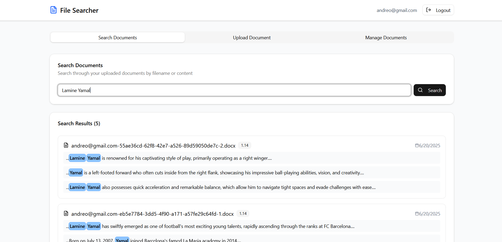

# AWS React File Searcher 📄🔍

A robust full-stack file searcher application enabling users to upload PDF and Word documents, index their content, and perform full-text searches with highlighting. Built with a modern React frontend and a scalable AWS serverless backend.



## 🔍 Description

This project provides a comprehensive solution for managing and searching document content. Users can securely upload PDF and Word files, which are then processed and indexed to allow for powerful text-based searches. The application features document listing, search with text highlighting, and deletion capabilities, all powered by AWS's serverless architecture.

## 🚀 Features

*   **Secure User Authentication (Emulated):** User email is stored locally to emulate authentication.
*   **Document Upload:**
    *   Upload single `.pdf` or `.docx` files.
    *   Frontend requests pre-signed URLs from the backend for direct and secure S3 uploads.
*   **Automated File Processing:**
    *   AWS S3 sends notifications to AWS SQS upon file upload.
    *   AWS Lambda functions are triggered by SQS messages to process files.
    *   Parsing of PDF/Word content to extract text (using a suitable library).
    *   Indexed text stored in AWS OpenSearch for efficient full-text search.
*   **Document Management:**
    *   **List Documents:** View uploaded documents with filenames and upload dates.
    *   **Search Documents:** Perform full-text searches across document content.
        *   Search results display filenames and highlight the relevant parts of the text where the search query was found.
    *   **Delete Documents:** Endpoint to delete documents, ensuring removal from the database, OpenSearch index, and S3 bucket.
*   **Responsive UI:** Built with React, TailwindCSS, and ShadCN UI for a modern and adaptable user experience.

## 🛠️ Tech Stack

### Frontend (`client/`)

*   **React 19**
*   **Vite** (build tool)
*   **TailwindCSS**
*   **ShadCN UI** (UI components)
*   **@tanstack/react-query** (data fetching and caching)
*   **Axios** (HTTP client)
*   **Sonner** (toasts/notifications)
*   **uuid** (unique ID generation)
*   **Lucide React** (icons)

### Backend & AWS Services

*   **AWS API Gateway:** Serves as the entry point for client-server interactions.
*   **AWS Lambda:** Serverless compute for backend logic (triggered by API Gateway and SQS).
*   **AWS S3:** Scalable object storage for uploaded files.
*   **AWS SQS:** Message queuing service for decoupling file uploads from processing.
*   **AWS DynamoDB:** NoSQL database for storing document metadata
*   **AWS OpenSearch:** Managed service for full-text search and analytics, used to index PDF/Word content and handle search queries with highlighting.
*   **AWS Amplify:** Hosting for the React frontend application.

## ⚙️ Installation

### 1. Clone the Repo

```bash
git clone https://github.com/andrew-dev-p/aws-react-file-searcher.git
cd aws-react-file-searcher
```

### 2. Setup Frontend

```bash
cd client
npm install
```

### 🧪 Running Locally

### Frontend

```bash
cd client
npm run dev
```

### Backend

The backend primarily consists of AWS Lambda functions triggered by API Gateway and SQS. For local development, you would typically use AWS SAM CLI or Serverless Framework to emulate these services, but detailed local setup for the server is beyond the scope of this README.

### 🔐 Environment Variables

```bash
VITE_API_URL="https://2xbcyufzck.execute-api.us-east-1.amazonaws.com" # Replace with your API Gateway endpoint
VITE_AWS_S3_BUCKET_NAME="file-searcher" # Replace with your S3 bucket name
```

### 📬 Deployment

- Client: Deployed on AWS Amplify.

- Backend: Deployed using AWS services (Lambda, API Gateway, SQS, S3, DynamoDB, OpenSearch).